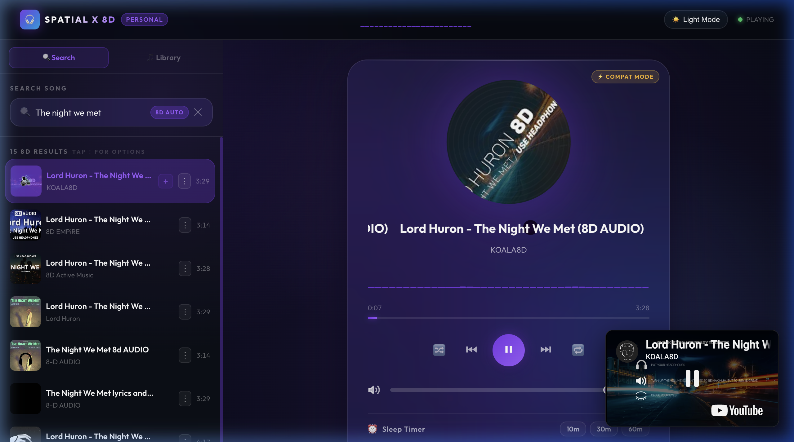
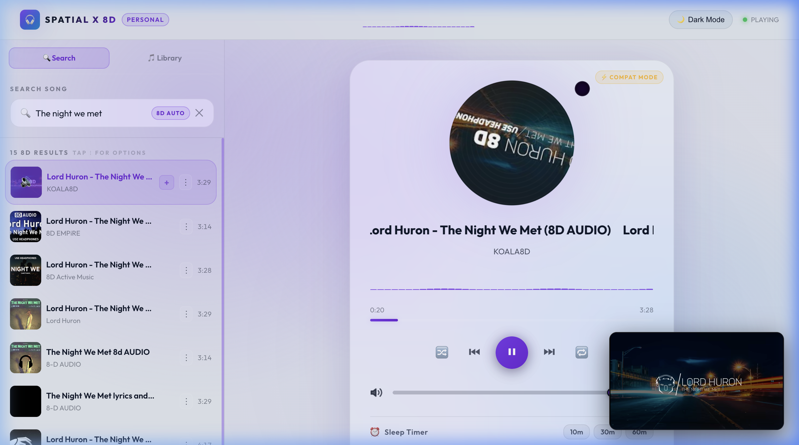
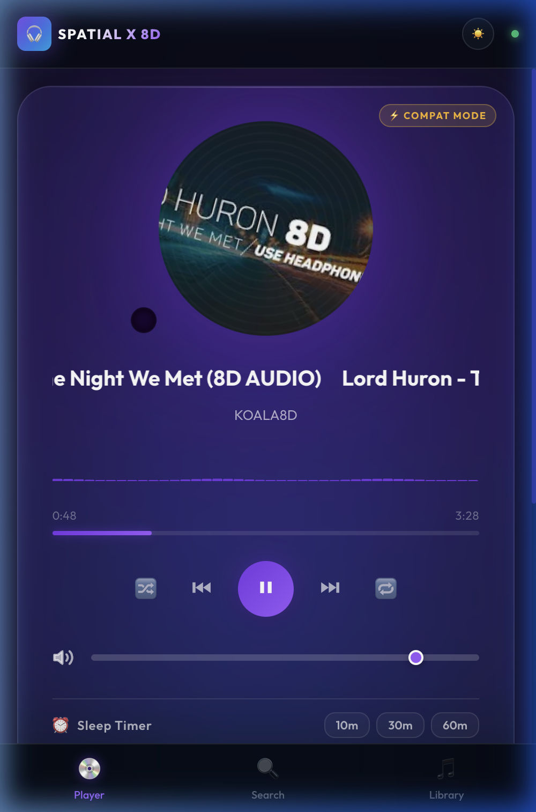
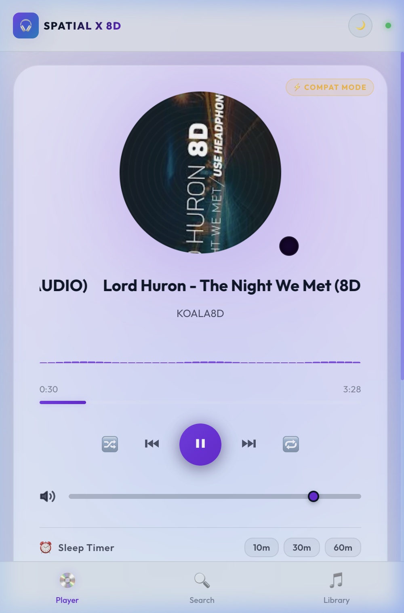

# SPATIAL-X-8D 🎧🌀

> **"8D music is just a commercial name for 3D/spatial audio. But man, does it sound amazing."**

> [!IMPORTANT]
> **Please use headphones!** The true 8D spatial sound experience relies on Head-Related Transfer Function (HRTF) audio rendering which directs spatialized channels directly to each ear. This effect cannot be correctly perceived through standard phone or laptop speakers.

Welcome to **SPATIAL-X-8D**! This is my first-ever hybrid mobile (Android) and desktop (macOS) application designed to process and experience any audio in **8D spatial surround sound**. 

This is a personal hobby project created out of a love for listening to 8D music. I wanted a way to turn standard audio files/URLs into full HRTF-based 3D orbital audio, and along the way, I built my first Android app wrapper and macOS desktop application!

This repository is strictly for my own personal use, archiving the development of my first hybrid mobile and desktop audio player.

## 📸 App Showcase

### Desktop App (macOS Wrapper via Electron)
| Dark Mode | Light Mode |
| :---: | :---: |
|  |  |

### Mobile App (Android Native Bridge via Capacitor/Java)
| Dark Mode | Light Mode |
| :---: | :---: |
|  |  |

---

## 🚀 The Tech Stack & Architecture

SPATIAL-X-8D is structured as a mono-repository containing three core layers:

```
SPATIAL-X-8D/
├── web/            # Core React + Vite Single Page Application (Capacitor target)
│   └── android/    # Native Android Project (Java + Capacitor bridge)
├── electron/       # Native macOS/Desktop Wrapper (Electron main & preload)
└── package.json    # Root scripts to orchestrate development & builds
```

### 1. The Core Audio Engine (`web/`)
* **React + Vite**: A lightning-fast development server and optimized build pipeline for the user interface.
* **Web Audio API**: The magic behind the 3D space.
  * **`PannerNode (HRTF)`**: Head-Related Transfer Function algorithms simulate how sound waves interact with human ears, creating a true, immersive 3D space rather than basic stereo panning.
  * **`ConvolverNode`**: Dynamically generates a synthetic decay impulse response (algorithmic hall reverb) to give the music depth, presence, and room ambience.
  * **`AnalyserNode`**: Provides fast Fourier transform (FFT) real-time frequency data for a custom visualizer.
  * **3D Orbital Math**: The sound source's position ($X, Y, Z$) is continuously updated in a circular orbit around the listener's head using trigonometric oscillation functions:
    $$X = \sin(\theta) \times r$$
    $$Z = \cos(\theta) \times r$$
    $$Y = \sin(0.35\theta) \times r \times 0.25$$

### 2. The Android Mobile App (`web/android/`)
* **Capacitor**: Modern web-to-native hybrid runtime container.
* **Custom Android Java Bridge (`MainActivity.java`)**: 
  * Bridges web events to a custom native Java Android `MediaPlaybackService`.
  * Controls audio playback using Android's native foreground playback service and notifications.
  * Ensures that audio continues playing seamlessly when the app is in the background or the screen is locked (bypassing default WebView background suspension policies).
  * Hooks directly into the system's `MediaSession` controls.

### 3. The Desktop macOS App (`electron/`)
* **Electron**: Wraps the web application in a native window with desktop integrations.
* **Preload Script**: Securely exposes system APIs to the frontend app.
* **Vite-to-Electron Asset pipeline**: Build scripts automate rebuilding the web bundle and feeding it directly into Electron's distribution directory.

---

> [!NOTE]
> This app works on all songs available in the 8D audio format. The integrated search service automatically appends `8D audio` to queries and targets optimized spatial mixes so that you can find and listen to any of your favorite tracks in 8D.

## 🛠️ Features

- **Dynamic 8D Orbiting**: Customize the rotation speed (Hz) and orbit radius (depth) of your audio.
- **Custom Algorithmic Reverb**: Control the wet/dry mix of a synthesised room reverb.
- **Real-Time Visualizer**: Interactive canvas showing current frequencies and orbital position of the sound.
- **Native Android Notification Controls**: Background playback with lock screen control toggles.
- **Cross-Platform**: Run the web player on any browser, run locally as a native macOS app, or build the APK for Android.

---

## 📜 License
This project is licensed under the [MIT License](LICENSE).


